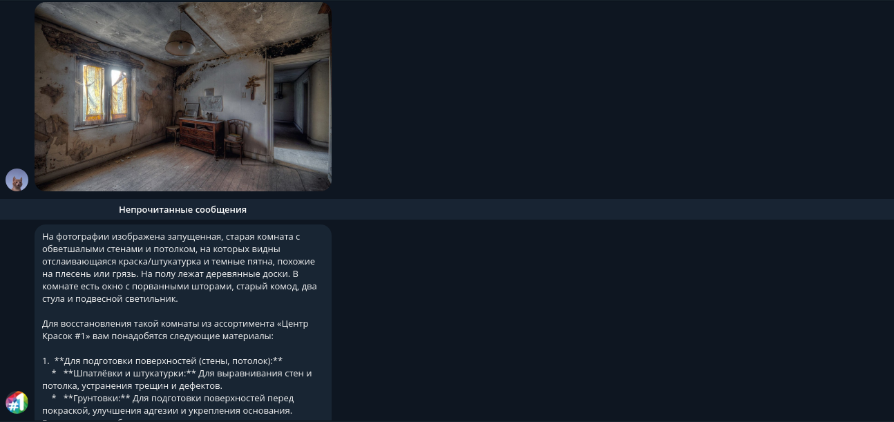
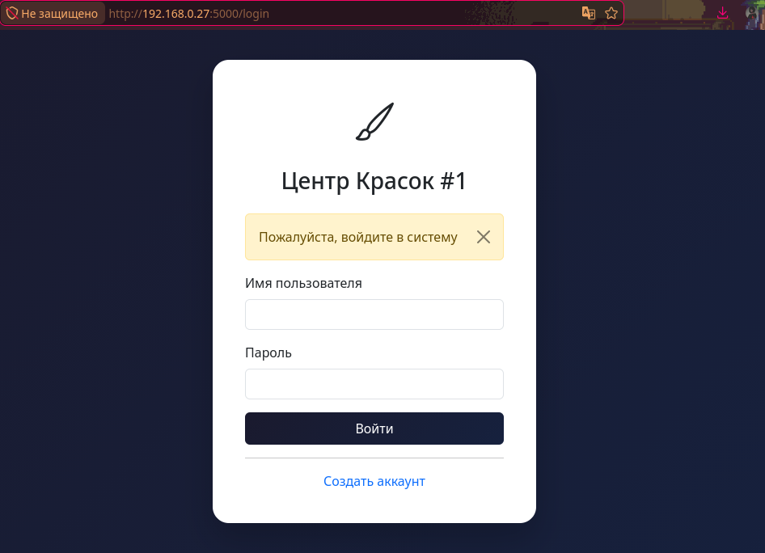
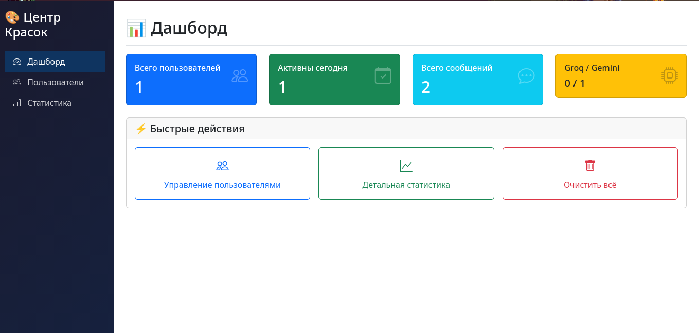

# 🎨 Центр Красок #1 — Telegram AI-бот

[](https://python.org)
[](https://docs.aiogram.dev)
[](https://ai.google.dev)
[](https://flask.palletsprojects.com)
[](https://sqlite.org)
[](https://docker.com)

**AI-ассистент для интернет-магазина «Центр Красок #1» в Telegram**

Бот отвечает на вопросы о компании, товарах, брендах, доставке, анализирует фотографии помещений и рекомендует подходящие материалы. В комплекте идёт **админ-панель** для просмотра статистики, пользователей и истории диалогов.

---

## ✨ Возможности

| Функция | Описание |
|---------|----------|
| 💬 **Умные ответы** | На основе базы знаний о компании (без галлюцинаций) |
| 📸 **Анализ фото** | Определяет тип помещения и рекомендует краски (Gemini Vision) |
| 🧠 **Контекст диалога** | Помнит последние 12 сообщений, автосброс через 30 минут |
| 🛡️ **Защита от спама** | Не более 10 сообщений в минуту на пользователя |
| 🌐 **Мультиязычность** | Поддерживает русский, казахский, английский языки |
| 📊 **Админ-панель** | Веб-интерфейс на Flask с графиками и статистикой |
| 💾 **Постоянное хранение** | SQLite база данных + резервное копирование в JSON |
| 🐳 **Docker Ready** | Готов к запуску в контейнере |

---

## 📋 Команды бота

Бот работает **без команд** — просто пишите сообщения. Единственная доступная команда:

| Команда | Описание |
|---------|----------|
| `/start` | Приветствие и информация о возможностях |

---

## 🔄 Автоматическое переключение AI моделей

Бот интеллектуально управляет использованием AI моделей для обеспечения максимальной надёжности:

| Состояние | Действие |
|-----------|----------|
| **Gemini работает** | ✅ Используется модель Gemini с полной функциональностью (текст + анализ фото) |
| **Ошибка Gemini API** | ⚠️ Автоматическое переключение на Groq (мгновенно, без потери диалога) |
| **Groq активна** | ✅ Работает быстрая модель Groq (только текст, без анализа фото) |
| **Через 1 час после ошибки** | 🔄 Бот пробует вернуться на Gemini |
| **Gemini восстановилась** | ✅ Автоматический возврат на Gemini с полным функционалом |
| **Gemini снова недоступна** | ⚠️ Повторное переключение на Groq |

### Преимущества такого подхода:

- 🔄 **Бот никогда не падает** — всегда есть запасная модель
- 📸 **Приоритет Gemini** — анализ фото работает, когда возможно
- ⚡ **Groq как резерв** — быстрые ответы при проблемах с Gemini
- 🔁 **Автоматическое восстановление** — не требует ручного вмешательства
- 💬 **Пользователь не замечает переключения** — диалог продолжается

### Ручное управление (опционально):

В будущем пользователи смогут вручную переключить модель с помощью скрытых команд:

| Команда | Действие |
|---------|----------|
| `/switch gemini` | Принудительно переключиться на Gemini |
| `/switch groq` | Принудительно переключиться на Groq |

> 💡 **Рекомендуемая модель:** Gemini (обеспечивает анализ фотографий).
> Но т.к в ТЗ было написано без команд, команды для переключения нет, считайте лимит как у GPT)

## 🚀 Быстрый старт

### 1. Получить токены

| Сервис | Где получить | Для чего |
|--------|--------------|----------|
| **Telegram Bot Token** | [@BotFather](https://t.me/BotFather) | Обязательно |
| **Gemini API Key** | [Google AI Studio](https://aistudio.google.com/) | Анализ фото + текст |
| **Groq API Key** (опционально) | [Console Groq](https://console.groq.com/) | Альтернативная модель (только текст) |

> 💡 Для работы достаточно **Gemini API** — она обеспечивает и текст, и анализ фото.

### 2. Клонировать и настроить

```bash
# Клонирование репозитория
git clone https://github.com/yourusername/centr-krasok-bot.git
cd centr-krasok-bot

# Создать виртуальное окружение
python -m venv venv
source venv/bin/activate  # Linux/Mac
# venv\Scripts\activate   # Windows

# Установить зависимости
pip install -r requirements.txt

# Создать файл с переменными окружения
cp env.example .env

# Отредактировать .env, добавив токены
nano .env

Пример `.env` файла:
```env
TELEGRAM_BOT_TOKEN=1234567890:ABCdefGHIjklMNOpqrsTUVwxyz
GEMINI_API_KEY=AIzaSy...
GROQ_API_KEY=gsk_...  # опционально

# Настройки админ-панели
ADMIN_SECRET_KEY=your-secret-key-here
ADMIN_USERNAME=admin
ADMIN_PASSWORD=admin123
```

### 3. Инициализировать базу данных (первый запуск)

```bash
# Запустить миграцию JSON → SQLite
python3 migrate.py
```

### 4. Запустить бота

```bash
# Простой запуск
python3 app.py

# Или через Docker
docker-compose up -d
```

### 5. Открыть админ-панель

После запуска бота откройте в браузере: **http://localhost:5000**

- **Логин:** `admin`
- **Пароль:** `admin123`

---

## 📁 Структура проекта

```
centr_krasok_telebot/
├── app.py                 # Telegram бот (aiogram)
├── admin.py               # Flask админ-панель
├── database.py            # Работа с SQLite
├── company_data.py        # База знаний о компании
├── requirements.txt       # Python-зависимости
├── .env                   # Переменные окружения (не в Git)
├── .gitignore             # Игнорируемые файлы
├── Dockerfile             # Контейнеризация
├── docker-compose.yml     # Оркестрация Docker
├── migrate.py             # Миграция JSON → SQLite
├── bot_data.db            # SQLite база данных (создаётся при запуске)
├── bot_data.json          # Резервное копирование данных
└── templates/             # HTML шаблоны админ-панели
    └── admin/
        ├── index.html     # Главная страница
        ├── users.html     # Список пользователей
        ├── stats.html     # Статистика
        └── conversations.html  # История диалогов
```

---

## 📡 Админ-панель

| Страница | Описание |
|----------|----------|
| **Дашборд** | Общая статистика: пользователи, сообщения, активность |
| **Пользователи** | Список всех пользователей с активностью и моделью |
| **История диалогов** | Просмотр полной переписки с каждым пользователем |
| **Статистика** | Графики распределения моделей и активности |

### API эндпоинты (для разработчиков)

| Эндпоинт | Метод | Описание |
|----------|-------|----------|
| `/api/stats` | GET | Получить статистику в JSON |
| `/api/users` | GET | Получить список пользователей в JSON |
| `/api/user/{id}/model` | POST | Сменить AI модель пользователя |
| `/api/conversations/{id}/clear` | POST | Очистить историю диалога |

---

## 🧠 Технические детали

### Контекст диалога
- Хранится **в памяти** (быстрый доступ)
- Максимум **12 сообщений** в истории
- **Автосброс** через 30 минут неактивности
- Дублируется в **SQLite** для админ-панели

### Защита от галлюцинаций AI
Системный промпт строго ограничивает ответы базой знаний:
- ❌ Запрещено придумывать цены, бренды, адреса
- ✅ Ответ только на основе `COMPANY_KNOWLEDGE`
- ✅ При отсутствии информации — предложение позвонить

### Rate Limiting
- Не более **10 сообщений в минуту** на пользователя
- Максимальная длина текста: **4096 символов**
- Максимальный размер фото: **20 MB**

### Хранение данных
- **SQLite** — основное хранилище (сохраняется после перезапуска)
- **JSON** — резервное копирование (каждые 30 секунд)
- История сохраняется **навсегда** (до ручной очистки)

---

## 📸 Скриншоты

### Telegram бот


### Админ-панель


### Дашборд


## 🐳 Docker

### Запуск через Docker Compose

```bash
# Сборка и запуск
docker-compose up -d

# Просмотр логов
docker-compose logs -f

# Остановка
docker-compose down
```

### Dockerfile
```dockerfile
FROM python:3.11-slim
WORKDIR /app
COPY requirements.txt .
RUN pip install --no-cache-dir -r requirements.txt
COPY . .
CMD ["python", "app.py"]
```

---

## 📦 Зависимости (requirements.txt)

```txt
aiogram>=3.0.0          # Telegram Bot API
groq>=0.5.0             # Groq API (опционально)
python-dotenv>=1.0.0    # Переменные окружения
Pillow>=10.0.0          # Обработка изображений
google-generativeai>=0.8.0  # Gemini API
flask>=2.0.0            # Админ-панель
```

---

## 💬 Примеры запросов

**Текстовые вопросы:**
- «Чем занимается компания?»
- «Какие краски для детской комнаты?»
- «Где находится офис в Алматы?»
- «Есть ли доставка в Астану?»
- «Какие бренды красок вы продаёте?»
- «Какие скидки сейчас действуют?»

**Отправка фото:**
- Сфотографируйте комнату и отправьте — бот определит тип помещения и порекомендует краски

---

## 🏗️ Архитектура

```
┌─────────────────┐     ┌─────────────────┐     ┌─────────────────┐
│   Telegram      │────▶│     Bot         │────▶│   Gemini API    │
│   User          │◀────│   (aiogram)     │◀────│   (Google)      │
└─────────────────┘     └────────┬────────┘     └─────────────────┘
                                 │
                                 ▼
┌─────────────────┐     ┌─────────────────┐
│   Admin Panel   │◀────│    SQLite       │
│   (Flask)       │────▶│    Database     │
└─────────────────┘     └─────────────────┘
```

---

## 📞 Контакты компании

| Канал | Ссылка |
|-------|--------|
| 🌐 Сайт | [centr-krasok.kz](https://centr-krasok.kz) |
| 📸 Instagram | [@centr_krasok](https://instagram.com/centr_krasok) |
| 📘 Facebook | [Центр Красок #1](https://facebook.com/profile.php?id=100075230594445) |
| 📞 Телефон | +7 (777) 292-84-01 |
| ✉️ Email | info@centr-krasok.kz |
| 🕐 Режим работы | Пн–Вс 10:00–20:00 |


⭐ Если проект вам помог или понравился — поставьте звезду на GitHub!
